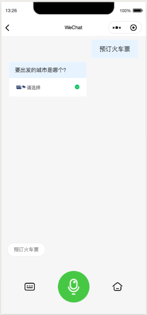
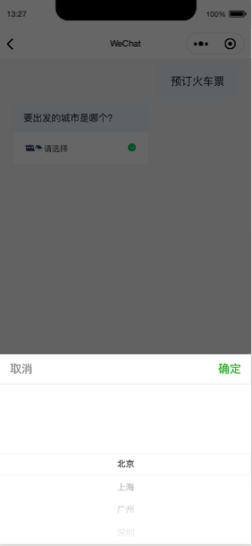
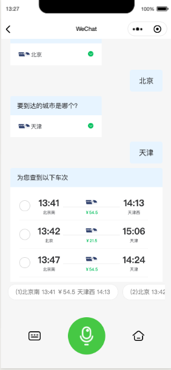
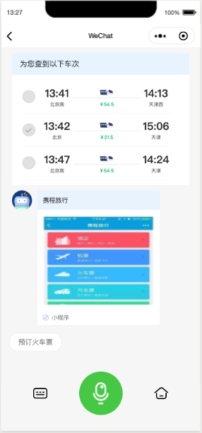

# 微信对话开放平台小程序插件火车票查询demo


此项目为微信对话开放平台开源项目，用于微信开发者进行插件快速接入、 组件复写功能开发时的参考Demo。微信开发者可以参考项目中的代码来开发应用，也可以直接使用项目中的代码到自己的App中。

开发者可以自由使用并传播本代码，但需要保留原作者信息。

联系我们：wechatopenai@tencent.com


插件申请使用地址：

https://mp.weixin.qq.com/wxopen/plugindevdoc?appid=wx8c631f7e9f2465e1

微信对话开放平台小程序插件复写示例提供了对插件的开放能力， 可以随意定制化。

> 请在 `project.config.json` 中配置自己小程序的appid或测试ID
> 此示例代码仅做为接入微信对话开放平台小程序插件的示例供开发者参考







## 1.参考https://github.com/WeChatAI/openai-plugin-overwrite 复写小程序插件的customTextMessage/customQueryMessage/customMiniprogramMessage组件

```json

{
  "usingComponents": {
    "chat": "plugin://myPlugin/chat",
    "customTextMessage": "../components/customTextMessage/customTextMessage",
    "customQueryMessage": "../components/customQueryMessage/customQueryMessage",
    "customMiniprogramMessage": "../components/customMiniprogramMessage/customMiniprogramMessage"
  }
}

```
## 2. msg对象上的res.slots_info数组中的第一个值是当前要追问的槽位内容，可以根据自己的业务需求进行逻辑处理。
在火车票的示例中，我们通过判断msg.res.slots_info[0]当中slot_name来判断槽位类型，当slot_name为_stoask_且slot_value为出发地时，我们在页面上触发出发地选择逻辑，当slot_name为_stoask_且slot_value为目的地时，我们在页面上触发目的地选择逻辑，当slot_name为_data_list_candidates_时，我们触发车次选择逻辑。


## License Copyright (c) 2019 Tencent

Permission is hereby granted, free of charge, to any person obtaining a copy of this software and associated documentation files (the "Software"), to deal in the Software without restriction, including without limitation the rights to use, copy, modify, merge, publish, distribute, sublicense, and/or sell copies of the Software, and to permit persons to whom the Software is furnished to do so, subject to the following conditions:

The above copyright notice and this permission notice shall be included in all copies or substantial portions of the Software.

THE SOFTWARE IS PROVIDED "AS IS", WITHOUT WARRANTY OF ANY KIND, EXPRESS OR IMPLIED, INCLUDING BUT NOT LIMITED TO THE WARRANTIES OF MERCHANTABILITY, FITNESS FOR A PARTICULAR PURPOSE AND NONINFRINGEMENT. IN NO EVENT SHALL THE AUTHORS OR COPYRIGHT HOLDERS BE LIABLE FOR ANY CLAIM, DAMAGES OR OTHER LIABILITY, WHETHER IN AN ACTION OF CONTRACT, TORT OR OTHERWISE, ARISING FROM, OUT OF OR IN CONNECTION WITH THE SOFTWARE OR THE USE OR OTHER DEALINGS IN THE SOFTWARE.