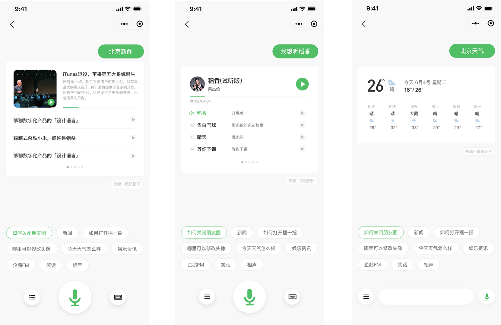
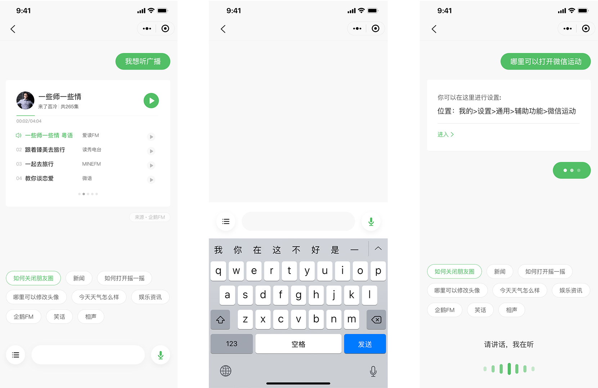
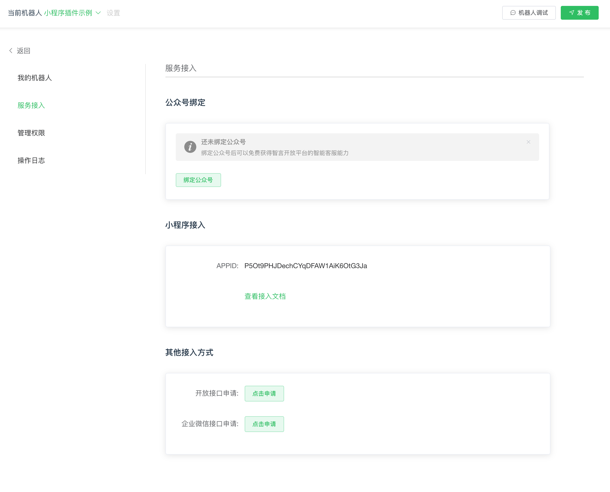

# 微信对话开放平台小程序插件


[微信对话开放平台](http://openai.weixin.qq.com)是以对话交互为核心, 为有客服需求的个人、企业和组织提供智能业务服务与用户管理能力的技能配置平台,
技能开发者可利用我们提供的工具自主完成客服机器人的搭建。此小程序插件为小程序开发者提供快速对接微信AI语意的能力。





> 微信对话开放平台小程序插件，提供两种调用方式，一种是有UI组件式调用，另一种是无UI
功能接口调用。


## 1.插件配置


> 请在 [微信对话开放平台](https://openai.weixin.qq.com) 上获得插件所需appid

在小程序 `app.json` 中 配置, 小程序插件id是 `wx8c631f7e9f2465e1`, 请使用最新稳定版本

```js
{
  "pages": [
    "pages/index/index"
  ],
  "plugins": {
    "chatbot": {
      "version": "1.0.8",
      "provider": "wx8c631f7e9f2465e1"
    }
  },
  "requiredBackgroundModes": [
    "audio"
  ],
  "sitemapLocation": "sitemap.json"
}
```

> 当使用有UI版本时，需要额外使用WechatSI组件, 只使用接口不使用UI时，使用上面的配置就可以了

```
{
  "pages": [
    "pages/index/index",
    "pages/newsPage/newsPage",
    "pages/common/common"
  ],
  "plugins": {
    "myPlugin": {
      "version": "1.0.8",
      "provider": "wx8c631f7e9f2465e1"
    },
    "WechatSI": {
      "version": "0.3.1",
      "provider": "wx069ba97219f66d99"
    }
  },
  "requiredBackgroundModes": ["audio"],
  "sitemapLocation": "sitemap.json"
}

```


## 2. 无UI(只获取NLU结果), 直接调用插件接口

> 代码中所示appid：`P5Ot9PHJDechCYqDFAW1AiK6OtG3Ja` 为示例账户，正式产品内使用请到
> [微信对话开放平台](https://openai.weixin.qq.com) 申请账户，然后到
> [设置-服务接入](https://openai.weixin.qq.com/) 查看对应的小程序ID
> 

### 2.1 组件初始化

```js

var plugin = requirePlugin("chatbot");

App({
  onLaunch: function() {
    console.log(plugin, "+++");
    plugin.init({
        appid: "P5Ot9PHJDechCYqDFAW1AiK6OtG3Ja", //小程序示例账户，仅供学习和参考
        openid: "",//用户的openid，非必填，建议传递该参数
        success: () => {}, //非必填
        fail: error => {} //非必填
    });
  }
});


```

### 2.2 发送query


```js

plugin.send({
  query: "你好",
  success: res => {
    console.log(res);
  },
  fail: error => {}
});

```


### 2.3 设置guideList


>从版本 1.0.8 开始，支持根据上下文,随时修改用户提示语的方法

```
    plugin.setGuideList(['内容', '内容'])
```


### 2.4 设置textToSpeech


>从版本 1.0.8 开始，支持根据上下文,随时修改是否打开语音播报

```
    plugin.setTextToSpeech(false)
```


### 2.5 NLU结果

```json
{
  "ans_node_id": 6666,
  "ans_node_name": "天气服务",
  "answer": "北京今天小雨，温度18到29度，当前温度27度，空气质量轻度污染，今天有雨，略微偏热，注意衣物变化。",
  "answer_open": 1,
  "answer_type": "text",
  "article": "",
  "bid_stat": {
    "curr_time": "20190826-16:34:56",
    "err_msg": "",
    "latest_time": "20190826-16:34:56",
    "latest_valid": true,
    "up_ret": 0
  },
  "confidence": 1,
  "create_time": "1566810973035",
  "dialog_status": "COMPLETE",
  "from_user_name": "o9U-85tEZToQxIF8ht6o-KkagxO0",
  "intent_confirm_status": "",
  "list_options": false,
  "msg": [
    {
      "ans_node_id": 6666,
      "ans_node_name": "天气服务",
      "article": "",
      "confidence": 1,
      "content": "北京今天小雨，温度18到29度，当前温度27度，空气质量轻度污染，今天有雨，略微偏热，注意衣物变化。",
      "debug_info": "",
      "list_options": false,
      "msg_type": "text",
      "resp_title": "天气服务",
      "status": "CONTEXT_FAQ"
    }
  ],
  "ret": 0,
  "skill_id": "",
  "skill_type": "",
  "slot_info": [
    {
      "date": "{\"type\":\"DT_ORI\",\"date_ori\":\"今天\",\"date\":\"2019-08-26\",\"date_lunar\":\"2019-08-26\",\"week\":\"1\",\"slot_content_type\":\"2\",\"modify_times\":\"0\"}"
    },
    {
      "from_loc": "{\"type\":\"LOC_CHINA_CITY\",\"country\":\"中国\",\"city\":\"北京\",\"city_simple\":\"北京\",\"loc_ori\":\"北京\",\"slot_content_type\":\"2\",\"modify_times\":\"1\"}"
    }
  ],
  "slots_info": [
    {
      "confirm_status": "NONE",
      "end": 0,
      "entity_type": "",
      "norm": "2019-08-26",
      "norm_detail": "",
      "slot_name": "date",
      "slot_value": "{\"type\":\"DT_ORI\",\"date_ori\":\"今天\",\"date\":\"2019-08-26\",\"date_lunar\":\"2019-08-26\",\"week\":\"1\",\"slot_content_type\":\"2\",\"modify_times\":\"0\"}",
      "start": 0
    },
    {
      "confirm_status": "NONE",
      "end": 6,
      "entity_type": "LOC_CHINA_CITY",
      "norm": "{\"type\":\"LOC_CHINA_CITY\",\"country\":\"中国\",\"city\":\"北京\",\"city_simple\":\"北京\",\"loc_ori\":\"北京\"}",
      "norm_detail": "",
      "slot_name": "from_loc",
      "slot_value": "{\"type\":\"LOC_CHINA_CITY\",\"country\":\"中国\",\"city\":\"北京\",\"city_simple\":\"北京\",\"loc_ori\":\"北京\",\"slot_content_type\":\"2\",\"modify_times\":\"1\"}",
      "start": 0
    }
  ],
  "status": "CONTEXT_FAQ",
  "title": "天气服务",
  "to_user_name": "10808"
}
```


## 3.有UI，直接使用标记组件，无需接口调用


> 代码中所示appid：`P5Ot9PHJDechCYqDFAW1AiK6OtG3Ja` 为示例账户，正式产品内使用请到
> [微信对话开放平台](https://openai.weixin.qq.com) 申请账户，然后到
> [设置-服务接入](https://openai.weixin.qq.com/) 查看对应的小程序ID
> 


### 3.1 组件初始化


```js

var plugin = requirePlugin("chatbot");

App({
  onLaunch: function() {
    console.log(plugin, "+++");
    plugin.init({
      appid: "P5Ot9PHJDechCYqDFAW1AiK6OtG3Ja", //小程序示例账户，仅供学习和参考
      openid: "", //小程序用户openid，非必填
      success: () => {},
      fail: error => {}
    });
  }
});

```

### 3.2 在组件内进行配置

在页面的配置json内进行配置，比如 `pages/index/index.json`


```
{
  "usingComponents": {
    "chat": "plugin://chatbot/chat"
  }
}
```


### 3.3. 使用组件


> chat组件外部必须指定容器, 并设置容器高度, 如果全屏展示, 设置高度为100vh, 如果是自定义导航栏, 设置高度为(100vh - 导航栏的高度)即可.


```html
<!-- 自定义导航 -->
<view style="height: 100vh;">
  <view class='nav-wrap' style='height: 100px;'>
    <view class='nav-title' style='line-height: 100px'>自定义导航</view>
  </view>
  <view style="height: calc(100vh - 100px)">
    <chat  bind:backHome="goBackHome" />
  </view>
</view>

```
```html
<!-- 系统导航 -->
<view style="height: 100vh">
    <chat bind:backHome="goBackHome" />
</view>

```

```js
  // goBackHome回调 返回上一级页面
  goBackHome: function () {
    wx.navigateBack({
      delta: 1
    })
  }
```


#### 3.3.1. 每次返回结构后，触发`queryCallback`


> chat组件外部必须指定容器, 并设置容器高度, 如果全屏展示, 设置高度为100vh, 如果是自定义导航栏, 设置高度为(100vh - 导航栏的高度)即可.

```html
<view style="height: 100vh">
    <chat bind:queryCallback="getQueryCallback" bind:backHome="goBackHome" />
</view>

```

```js
  // getQueryCallback回调 返回query与结果
  getQueryCallback: function (e) {
    console.log(e.detail);
  },
  // goBackHome回调 返回上一级页面
  goBackHome: function () {
    wx.navigateBack({
      delta: 1
    })
  }
```

## 4 消息组件重写(自定义插件内容的样式)

从版本1.0.7开始支持对小程序内置插件的替换，包括文本消息，天气消息，图片消息，音乐消息，新闻消息和引导消息


```html
<view style="height: 100vh">
   <chat bind:queryCallback="getQueryCallback" bind:backHome="goBackHome"
      generic:textMessage="customTextMessage"
      generic:weatherMessage="customWeatherMessage"
      generic:imageMessage="customImageMessage"
      generic:musicMessage="customMusicMessage"
      generic:newsMessage="customNewsMessage"
      generic:unsupportedMessage="customUnsupportedMessage"
      generic:guideCard="customGuideCard">
   </chat>
</view>
```

```json
{
  "usingComponents": {
    "chat": "plugin://myPlugin/chat",
    "customTextMessage": "../customTextMessage/customTextMessage",
    "customWeatherMessage": "../customWeatherMessage/customWeatherMessage",
    "customImageMessage": "../customImageMessage/customImageMessage",
    "customMusicMessage": "../customMusicMessage/customMusicMessage",
    "customNewsMessage": "../customNewsMessage/customNewsMessage",
    "customUnsupportedMessage": "../customUnsupportedMessage/customUnsupportedMessage",
    "customGuideCard": "../customGuideCard/customGuideCard",
  }
}
```

### 4.1支持覆盖的组件类别：

1. textMessage: 文本类消息
2. weatherMessage: 天气类消息
3. imageMessage: 图片类消息
4. musicMessage: 音乐类消息
5. newsMessage: 新闻类消息
6. unsupportedMessage: 暂未支持类消息
7. guideCard: 引导消息

> 以上七种消息中，组件 `1-6` 会在组件上收到一个properties参数 `msg`

```js
     <textMessage msg="{{item}}"></textMessage>
    <weatherMessage msg="{{item}}"></weatherMessage>
    <newsMessage   msg="{{item}}"></newsMessage>
    <musicMessage  msg="{{item}}"></musicMessage>
    <imageMessage  msg="{{item}}"></imageMessage>
    <unsupportedMessage msg="{{item}}"></unsupportedMessage>

```

#### 4.1.1 `textMessage` 的 properties 参数 msg的数据结构：

```json

  {
    msg_type: "text",
    content: "机器人对话结果",
    res: res //NLU结果
  };

```

#### 4.1.2 `weatherMessage` 的 properties 参数 msg的数据结构：

```json

  {
    cardType: "weather",
    answer: "机器人对话结果",
    docs: Array, //天气结果
    res: res //NLU结果
  };

```


#### 4.1.3 `newsMessage` 的 properties 参数 msg的数据结构：

```json

  {
    cardType: "news",
    answer: "机器人对话结果",
    docs: Array, //新闻结果
    res: res //NLU结果
  };

```

#### 4.1.4 `musicMessage` 的 properties 参数 msg的数据结构：

```json

  {
    cardType: "voice",
    answer: "",
    docs: Array, //音乐结果
  };

```

#### 4.1.5 `imageMessage` 的 properties 参数 msg的数据结构：


```json

  {
    cardType: "image",
    data: Object,
    res: res //NLU结果
  };

```


#### 4.1.6 `unsupportedMessage` 的 properties 参数 msg的数据结构：


```json

  {
    cardType: "unsupported",
    data: Object,//自定义的JSON结构
    res: res //NLU结果
  };

```


### 4.2 guideCard 的properties参数

```js

    <guideCard guideList="{{guideList}}" controlSwiper="{{controlSwiper}}"></guideCard>

```


properties 说明:

字段|类型|描述
--|--|--|--|--
guideList|Array|[ "北京天气怎么样", "上海今天有雨吗", "中午吃啥呢", "你知道如何排解压力吗", "法国国土面积是多少", "世界最高峰" ] | 自定义提示语
controlSwiper|Boolean|用来通知用户引导模块是否应当响应用户点击事件，防止误触发生
bind:chooseGuide|Event|当用户点击菜单内选项时，通知机器人用户点击的菜单内容


如果响应用户点击事件
```
   this.triggerEvent("chooseGuide", "用户点击了菜单的什么内容");
```


## 5. 初始化配置项

```
    plugin.init({
      ...options
      appid: "P5Ot9PHJDechCYqDFAW1AiK6OtG3Ja",
      success: () => {},
      fail: error => {},
      guideList: ["您好"],
      textToSpeech: true //默认为ture打开状态
    });
```


options 说明:

字段|类型|是否必填|默认值|描述
--|--|--|--|--
appid|string|是||微信对话开发平台申请的插件id
openid|string|否||微信小程序用户的opened
success|function|否||初始化成功的回调
fail|function|否||初始化失败的回调
guideList|Array|否|[ "北京天气怎么样", "上海今天有雨吗", "中午吃啥呢", "你知道如何排解压力吗", "法国国土面积是多少", "世界最高峰" ] | 自定义提示语
textToSpeech|Array|否|true|在有UI模式下，将文本回答朗读出来


## 6. 接入示例：

